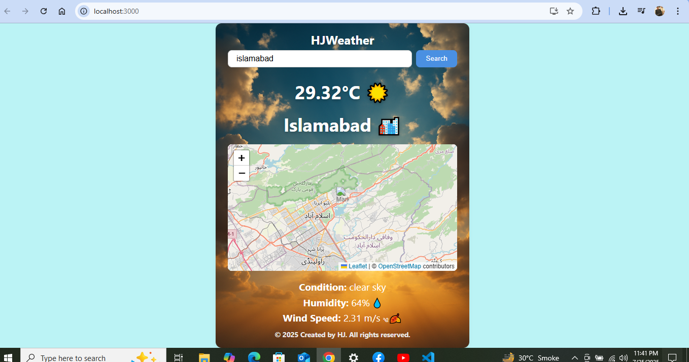

# HJWeather

HJWeather is a simple, modern weather app built with React.

## Features

- Live weather for any city
- Interactive map
- Clean, mobile-friendly UI

## Screenshot

## How to Run

1. Download the code.
2. Run `npm install`
3. Run `npm start`
